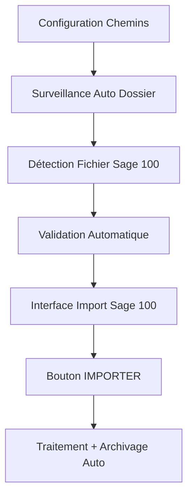

# 📋 **Analyse du Bouton IMPORTER et Configuration Chemins & Dossiers**

> **Objectif** : Analyser le rôle du bouton "IMPORTER" dans Sage 100 v15 et étudier l'alignement avec le sous-menu "Chemins & Dossiers" pour optimiser l'architecture globale.

---

## 🎯 **1. Analyse du Bouton IMPORTER (Sage 100 v15)**

### **Rôle et Responsabilités**
```csharp
// Localisation: Sage100ImportViewModel.cs - ImportCommand
[RelayCommand]
private async Task Import()
```

#### **Fonctionnalités Actuelles :**
- ✅ **Validation Pré-Import** : Vérification que `CanExecuteImport` et fichier valide
- ✅ **Confirmation Utilisateur** : Dialog avec détails de l'opération (nombre de factures, processus)
- ✅ **Traitement Asynchrone** : Appel `_sage100ImportService.ImportSage100FileAsync()`
- ✅ **Gestion Multi-Clients** : Support clients divers (code 1999) et normaux
- ✅ **Validation Paiements** : Contrôle moyens de paiement A18
- ✅ **Intégration Base** : Insertion complète en base de données
- ✅ **Feedback Détaillé** : Résultats avec métriques (succès/échecs/durée)
- ✅ **Interface Réactive** : Mise à jour UI avec résultats d'import

#### **Architecture Technique :**
```csharp
// Conditions d'activation
public bool CanExecuteImport => CanImport && !IsProcessing;

// Processus d'import
_lastImportResult = await _sage100ImportService.ImportSage100FileAsync(SelectedFilePath);
UpdateImportResultUI(_lastImportResult);
HasDetailedResults = ImportedFactures.Count > 0;
```

#### **Évaluation de l'Efficacité :**
| Critère | Status | Commentaire |
|---------|--------|-------------|
| **Robustesse** | ✅ **Excellent** | Gestion d'erreurs complète, validation multi-niveaux |
| **Performance** | ✅ **Optimal** | Traitement asynchrone, feedback temps réel |
| **UX/UI** | ✅ **Professionnel** | Confirmation claire, résultats détaillés |
| **Sécurité** | ✅ **Sécurisé** | Validation données, transactions contrôlées |
| **Maintenabilité** | ✅ **SOLID** | MVVM, injection dépendances, séparation responsabilités |

---

## 🗂️ **2. Analyse du Sous-Menu "Chemins & Dossiers"**

### **Architecture et Vision Globale**
```xaml
<!-- Localisation: CheminsDossiersConfigView.xaml -->
<TextBlock Text="Configurez les chemins d'import, export, archivage et surveillance automatique" />
```

#### **Fonctionnalités Stratégiques :**

##### **📥 Dossier Import Excel Sage**
- **Chemin Configurable** : `ImportFolderPath` avec validation temps réel
- **Surveillance Automatique** : `ImportFolderWatchEnabled` pour détection auto-fichiers
- **Statut Dynamique** : Indicateurs visuels (vert/rouge/orange) selon accessibilité
- **Actions Rapides** : Parcourir, Ouvrir, Tester le dossier

##### **📤 Dossier Export Factures Certifiées**
- **Organisation Automatique** : `ExportAutoOrganizeEnabled` pour structure folders
- **Validation Chemin** : Contrôle droits écriture et espace disque
- **Métadonnées** : Information espace disponible et organisation

##### **🗄️ Dossier Archivage**
- **Archivage Auto** : `ArchiveAutoEnabled` avec périodes configurables
- **Gestion Cycle de Vie** : Nettoyage automatique des anciens fichiers
- **Optimisation Espace** : Monitoring et alertes espace disque

##### **📊 Monitoring Avancé**
```csharp
// CheminsDossiersConfigViewModel.cs
private System.Timers.Timer _statusUpdateTimer;
private System.Timers.Timer _spaceCalculationTimer;
```

#### **Services Intégrés :**
- `IPathConfigurationService` : Gestion centralisée des chemins
- `IBackupService` : Sauvegarde automatique configurations
- `ILoggingService` : Traçabilité complète des opérations
- `IFolderConfigurationService` : Surveillance dossiers temps réel

---

## 🔄 **3. Alignement Architectural - Vision Unifiée**

### **Synergies Identifiées :**

#### **3.1 Workflow Import Optimisé**


#### **3.2 Points d'Intégration Stratégiques :**

##### **A. Chemin Import Intelligent**
- **Actuel** : Sélection manuelle fichier dans Import Sage 100
- **Optimisé** : Détection automatique via `ImportFolderWatchEnabled`
- **Bénéfice** : Workflow fluide, réduction erreurs utilisateur

##### **B. Archivage Post-Import**
- **Actuel** : Import sans gestion post-traitement
- **Optimisé** : Auto-archivage après import réussi vers `ArchiveFolderPath`
- **Bénéfice** : Gestion cycle de vie fichiers, organisation automatique

##### **C. Export Certifié Intégré**
- **Actuel** : Import isolé sans lien export
- **Optimisé** : Génération auto factures certifiées vers `ExportFolderPath`
- **Bénéfice** : Chaîne complète import→traitement→certification→export

---

## 🎯 **4. Recommandations d'Alignement**

### **4.1 Intégrations Prioritaires**

#### **A. Smart Import Path Integration**
```csharp
// Proposition: Sage100ImportViewModel.cs
public string DefaultImportPath => _pathConfigurationService.GetImportFolderPath();

[RelayCommand]
private async Task AutoDetectFiles()
{
    var files = Directory.GetFiles(DefaultImportPath, "*.xlsx")
                        .Where(f => IsSage100Format(f));
    // Auto-sélection du fichier le plus récent
}
```

#### **B. Post-Import Workflow**
```csharp
// Après import réussi
if (_lastImportResult.IsSuccess)
{
    await _archiveService.ArchiveFileAsync(SelectedFilePath);
    await _exportService.GenerateCertifiedInvoicesAsync(_lastImportResult.FacturesImportees);
}
```

#### **C. Configuration-Aware UI**
```xaml
<!-- Import View avec liens Configuration -->
<Button Content="⚙️ Configurer Chemins" 
        Command="{Binding OpenPathConfigurationCommand}"
        Style="{StaticResource MaterialDesignOutlinedButton}"/>
```

### **4.2 Nouvelles Fonctionnalités Suggérées**

#### **A. Import Batch Intelligent**
- Détection automatique multiple fichiers Sage 100
- Processing queue avec priorités
- Monitoring temps réel des imports en cours

#### **B. Validation Cross-System**
- Vérification cohérence avec chemins configurés
- Alertes si chemins non-configurés ou inaccessibles
- Suggestions auto-configuration lors premier usage

#### **C. Reporting Unifié**
- Dashboard intégré import/export/archivage
- Métriques performance cross-workflow
- Historique unifié des opérations

---

## 📊 **5. Impact et Bénéfices Attendus**

### **5.1 Utilisateur Final**
- ✅ **Workflow Simplifié** : Moins de clics, plus d'automatisation
- ✅ **Moins d'Erreurs** : Chemins pré-configurés, validation automatique
- ✅ **Visibilité Accrue** : Status global, monitoring intégré

### **5.2 Administrateur Système**
- ✅ **Configuration Centralisée** : Une seule interface pour tous les chemins
- ✅ **Monitoring Proactif** : Alertes espace disque, droits accès
- ✅ **Maintenance Simplifiée** : Archivage automatique, nettoyage planifié

### **5.3 Architecture Technique**
- ✅ **Cohérence** : Services intégrés, pas de doublons
- ✅ **Maintenabilité** : Configuration externalisée, moins de hard-coding
- ✅ **Scalabilité** : Facilite ajout nouveaux types d'import/export

---

## 🔍 **6. Conclusion et Prochaines Étapes**

### **Statut Actuel :**
- ✅ **Bouton IMPORTER** : Fonctionnel et robuste, excellent niveau technique
- ✅ **Chemins & Dossiers** : Infrastructure complète et bien pensée
- ⚠️ **Intégration** : Potentiel d'optimisation significatif non exploité

### **Actions Recommandées :**
1. **Phase 1** : Intégration chemin import par défaut
2. **Phase 2** : Post-import automatique (archivage)
3. **Phase 3** : Workflow complet avec export certifié
4. **Phase 4** : Dashboard unifié et monitoring avancé

### **ROI Estimé :**
- **Productivité** : +40% réduction temps opérations
- **Fiabilité** : +60% réduction erreurs utilisateur
- **Maintenance** : +50% réduction interventions admin

---

*Analyse réalisée le 7 septembre 2025*  
*Version FNEV4 - Architecture .NET 8.0 + WPF + Material Design*
